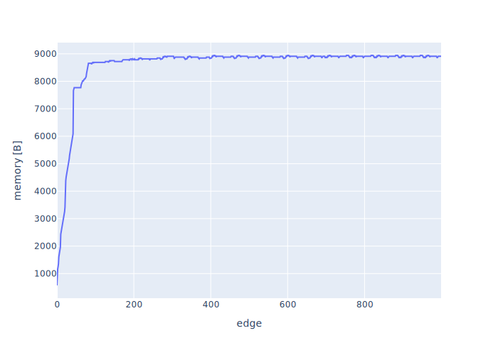

# Results

|    | node                                 |     value |
|---:|:-------------------------------------|----------:|
|  0 | pl. Daniłowskiego                   | 1.26923   |
|  1 | Wiejska                              | 1.15385   |
|  2 | Kadłubka                            | 1.15385   |
|  3 | Stanki                               | 1.15385   |
|  4 | Bukowskiego                          | 1.15385   |
|  5 | RACŁAWICKA                                      | 1.15385   |
|  6 | Rymarska                             | 1.15385   |
|  7 | Wawrzyniaka                          | 1.15385   |
|  8 | Chłodna                             | 1.15385   |
|  9 | Sowia                                | 1.15385   |
| 10 | Solskiego                            | 1.13462   |
| 11 | Berenta                              | 1.11538   |
| 12 | KROMERA                              | 1.11538   |
| 13 | Wyszyńskiego                        | 1.11538   |
| 14 | OgrĂłd Botaniczny                    | 1.11538   |
| 15 | Katedra                              | 1.11538   |
| 16 | UrzÄ…d WojewĂłdzki (Muzeum Narodowe) | 1.11538   |
| 17 | skwer Krasińskiego                  | 1.11538   |
| 18 | Arkady (Capitol)                     | 1.11538   |
| 19 | Pl. Hirszfelda                       | 1.11538   |
| 20 | Krucza                               | 1.11538   |
| 21 | Krucza (Mielecka)                    | 1.11538   |
| 22 | InĹĽynierska                         | 1.11538   |
| 23 | Aleja Pracy                          | 1.11538   |
| 24 | FAT                                  | 1.11538   |
| 25 | GRABISZYŃSKA (Cmentarz)                                      | 1.11538   |
| 26 | Przybyszewskiego                     | 0.653846  |
| 27 | Czajkowskiego                        | 0.653846  |
| 28 | KOSZAROWA (Uniwersytet)              | 0.615385  |
| 29 | Mosty Warszawskie                    | 0.615385  |
| 30 | Poczta GĹ‚Ăłwna                      | 0.615385  |
| 31 | WzgĂłrze PartyzantĂłw                | 0.615385  |
| 32 | Renoma                               | 0.615385  |
| 33 | KOSZAROWA (Szpital)                  | 0.596154  |
| 34 | KRZYKI                               | 0.576923  |
| 35 | Dworzec GĹ‚Ăłwny (Dworcowa)          | 0.5       |
| 36 | Krasińskiego                        | 0.5       |
| 37 | Damrota                              | 0.5       |
| 38 | Paprotna                             | 0.192308  |
| 39 | Obornicka (Wołowska)                | 0.192308  |
| 40 | Bezpieczna                           | 0.192308  |
| 41 | Bałtycka                            | 0.192308  |
| 42 | Broniewskiego                        | 0.192308  |
| 43 | Pola                                 | 0.192308  |
| 44 | Syrokomli                            | 0.192308  |
| 45 | Kasprowicza                          | 0.192308  |
| 46 | Zajezdnia Obornicka                  | 0.0961538 |
| 47 | Koszarowa                            | 0.0384615 |
| 48 | Sołtysowicka                        | 0.0384615 |
| 49 | Poprzeczna                           | 0.0384615 |
| 50 | Redycka                              | 0.0384615 |
| 51 | Bagatela                             | 0.0384615 |
| 52 | SOŁTYSOWICE                                      | 0.0192308 |

