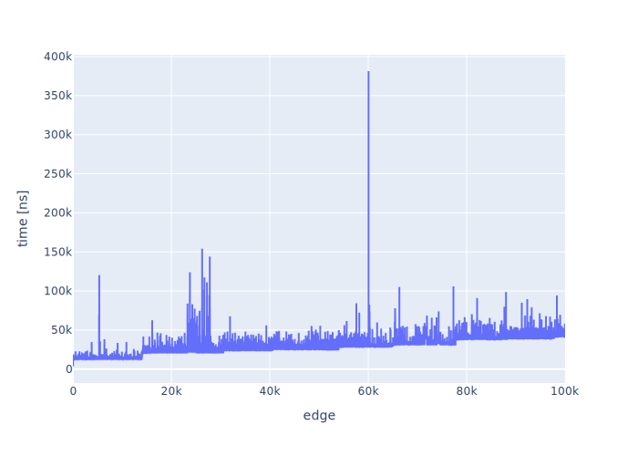
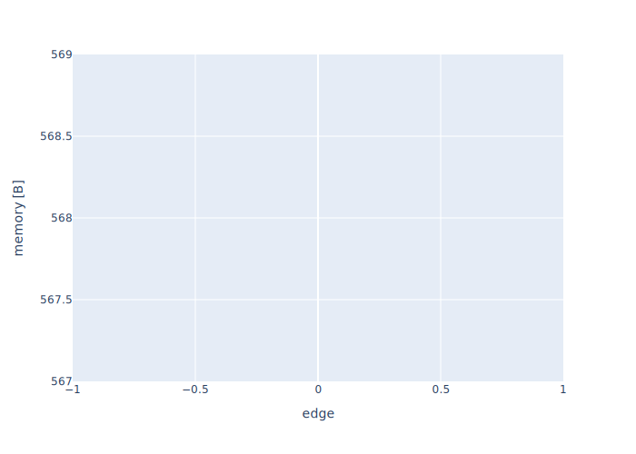

# Results

|     | node                                     |      value |
|----:|:-----------------------------------------|-----------:|
|   0 | GALERIA DOMINIKAŃSKA                     | 25.3202    |
|   1 | PL. GRUNWALDZKI                          | 16.4335    |
|   2 | DWORZEC GŁÓWNY                           | 16.1478    |
|   3 | Arkady (Capitol)                         | 15.5862    |
|   4 | Katedra                                  | 15.2906    |
|   5 | Urząd Wojewódzki (Muzeum Narodowe)       | 15.1133    |
|   6 | Wyszyńskiego                             | 14.6897    |
|   7 | Brücknera                                | 11.8227    |
|   8 | Psie Pole                                | 11.8227    |
|   9 | Psie Pole (Rondo Lotników Polskich)      | 11.8227    |
|  10 | Kliniki - Politechnika Wrocławska        | 11.4089    |
|  11 | Hala Stulecia                            | 11.4089    |
|  12 | ZOO                                      | 11.4089    |
|  13 | Tramwajowa                               | 11.4089    |
|  14 | Chełmońskiego                            | 11.4089    |
|  15 | Piramowicza (Kampus Biskupin)            | 11.4089    |
|  16 | Spółdzielcza                             | 11.4089    |
|  17 | Broniewskiego                            | 11.3103    |
|  18 | KROMERA                                  | 11.1724    |
|  19 | Hallera                                  | 10.6995    |
|  20 | Orla                                     | 10.6995    |
|  21 | Rondo                                    | 10.6601    |
|  22 | Kamieńskiego                             | 10.5616    |
|  23 | DWORZEC NADODRZE                         | 10.4236    |
|  24 | KRZYKI                                   |  9.92118   |
|  25 | DWORZEC AUTOBUSOWY                       |  9.90148   |
|  26 | Ogród Botaniczny                         |  9.83251   |
|  27 | Rynek                                    |  9.45813   |
|  28 | Świdnicka                                |  9.22167   |
|  29 | Pomorska                                 |  7.92118   |
|  30 | Wzgórze Partyzantów                      |  7.86207   |
|  31 | Poczta Główna                            |  7.44828   |
|  32 | Grudziądzka                              |  6.83744   |
|  33 | Wołowska                                 |  6.69951   |
|  34 | Kępińska                                 |  6.69951   |
|  35 | Kromera (Czajkowskiego)                  |  6.38424   |
|  36 | pl. Wróblewskiego                        |  6.33498   |
|  37 | Inflancka                                |  5.99015   |
|  38 | Kowieńska                                |  5.99015   |
|  39 | Żmudzka                                  |  5.99015   |
|  40 | Kiełczowska                              |  5.99015   |
|  41 | Poleska                                  |  5.99015   |
|  42 | KIEŁCZOWSKA (LZN)                        |  5.99015   |
|  43 | Zakrzowska                               |  5.83251   |
|  44 | Wallenroda                               |  5.83251   |
|  45 | Królewska                                |  5.83251   |
|  46 | Berenta                                  |  5.81281   |
|  47 | most Grunwaldzki                         |  5.76355   |
|  48 | BISKUPIN                                 |  5.70443   |
|  49 | Reja                                     |  5.63547   |
|  50 | Jeleniogórska                            |  5.49754   |
|  51 | Wschowska                                |  5.49754   |
|  52 | Złotnicka                                |  5.49754   |
|  53 | Kamiennogórska (Ośrodek dla niewidomych) |  5.49754   |
|  54 | Kosmonautów (Szpital)                    |  5.49754   |
|  55 | Grabowa                                  |  5.49754   |
|  56 | Aleja Architektów                        |  5.49754   |
|  57 | Glinianki                                |  5.49754   |
|  58 | Tarczyński Arena (Lotnicza)              |  5.49754   |
|  59 | PILCZYCE                                 |  5.49754   |
|  60 | Metalowców                               |  5.49754   |
|  61 | Bajana                                   |  5.49754   |
|  62 | Park Zachodni                            |  5.49754   |
|  63 | DH Astra                                 |  5.49754   |
|  64 | Kwiska                                   |  5.49754   |
|  65 | Małopanewska                             |  5.49754   |
|  66 | Niedźwiedzia                             |  5.49754   |
|  67 | Wrocław Mikołajów (Zachodnia)            |  5.49754   |
|  68 | pl. Strzegomski (Muzeum Współczesne)     |  5.49754   |
|  69 | Młodych Techników                        |  5.49754   |
|  70 | PL. JANA PAWŁA II                        |  5.49754   |
|  71 | Jastrzębia                               |  5.47783   |
|  72 | pl. Zgody (Muzeum Etnograficzne)         |  5.45813   |
|  73 | Na Niskich Łąkach                        |  5.45813   |
|  74 | Krakowska                                |  5.45813   |
|  75 | KRAKOWSKA (Centrum handlowe)             |  5.45813   |
|  76 | Armii Krajowej                           |  5.45813   |
|  77 | Park Wschodni                            |  5.45813   |
|  78 | Karwińska                                |  5.45813   |
|  79 | Głubczycka                               |  5.45813   |
|  80 | Słowiańska                               |  5.43842   |
|  81 | Zaolziańska                              |  5.43842   |
|  82 | Wielka                                   |  5.43842   |
|  83 | Sztabowa                                 |  5.43842   |
|  84 | Zamkowa                                  |  5.41872   |
|  85 | Zimowa                                   |  5.28079   |
|  86 | Os. Przyjaźni                            |  5.28079   |
|  87 | Skarbowców                               |  5.28079   |
|  88 | KLECINA                                  |  5.28079   |
|  89 | Kościelna                                |  5.28079   |
|  90 | WAŁBRZYSKA                               |  5.28079   |
|  91 | Marchewkowa                              |  5.28079   |
|  92 | Bezpieczna                               |  5.1133    |
|  93 | Nowowiejska                              |  5.0936    |
|  94 | Prusa                                    |  5.03448   |
|  95 | Piastowska                               |  5.03448   |
|  96 | Kwidzyńska                               |  5.02463   |
|  97 | Zacisze                                  |  5.02463   |
|  98 | Śniadeckich                              |  5.02463   |
|  99 | Kochanowskiego                           |  5.02463   |
| 100 | Trzebnicka                               |  5.02463   |
| 101 | Bałtycka                                 |  4.8867    |
| 102 | Mosty Warszawskie                        |  4.8867    |
| 103 | FAT                                      |  4.8867    |
| 104 | Renoma                                   |  4.84729   |
| 105 | GRABISZYŃSKA (Cmentarz)                  |  4.84729   |
| 106 | Damrota                                  |  4.76847   |
| 107 | pl. Daniłowskiego                        |  4.51232   |
| 108 | POŚWIĘTNE                                |  4.18719   |
| 109 | Aleja Pracy                              |  4.13793   |
| 110 | skwer Krasińskiego                       |  4.09852   |
| 111 | Pl. Hirszfelda                           |  4.09852   |
| 112 | Krucza                                   |  4.09852   |
| 113 | Krucza (Mielecka)                        |  4.09852   |
| 114 | Inżynierska                              |  4.09852   |
| 115 | Solskiego                                |  4.09852   |
| 116 | Wiejska                                  |  4.09852   |
| 117 | Kadłubka                                 |  4.09852   |
| 118 | Stanki                                   |  4.09852   |
| 119 | Bukowskiego                              |  4.09852   |
| 120 | RACŁAWICKA                               |  4.09852   |
| 121 | Rymarska                                 |  4.09852   |
| 122 | Wawrzyniaka                              |  4.09852   |
| 123 | Chłodna                                  |  4.09852   |
| 124 | Sowia                                    |  4.09852   |
| 125 | Kleczkowska                              |  3.96059   |
| 126 | pl. Strzelecki                           |  3.96059   |
| 127 | Mosty Pomorskie                          |  3.96059   |
| 128 | Mochnackiego                             |  3.86207   |
| 129 | Jutrosińska                              |  3.86207   |
| 130 | Kamieńskiego (Szpital)                   |  3.86207   |
| 131 | Różanka                                  |  3.68473   |
| 132 | Łużycka                                  |  3.68473   |
| 133 | most Osobowicki                          |  3.68473   |
| 134 | Borowska (Aquapark)                      |  3.68473   |
| 135 | Śliczna                                  |  3.68473   |
| 136 | Działkowa                                |  3.68473   |
| 137 | GAJ                                      |  3.68473   |
| 138 | Świeradowska                             |  3.68473   |
| 139 | Urząd Wojewódzki (Impart)                |  3.20197   |
| 140 | LITEWSKA                                 |  2.99507   |
| 141 | Kopańskiego                              |  2.91626   |
| 142 | OSIEDLE SOBIESKIEGO                      |  2.91626   |
| 143 | PETRUSEWICZA                             |  2.80788   |
| 144 | LEŚNICA                                  |  2.74877   |
| 145 | KSIĘŻE MAŁE                              |  2.72906   |
| 146 | GIEŁDOWA (Centrum Hurtu)                 |  2.64039   |
| 147 | Pola                                     |  2.42365   |
| 148 | Syrokomli                                |  2.42365   |
| 149 | Przybyszewskiego                         |  2.12808   |
| 150 | Czajkowskiego                            |  2.12808   |
| 151 | KOSZAROWA (Szpital)                      |  2.09852   |
| 152 | KOSZAROWA (Uniwersytet)                  |  2.08867   |
| 153 | Dworzec Główny (Dworcowa)                |  2.0197    |
| 154 | Krasińskiego                             |  2.00985   |
| 155 | KAMIEŃSKIEGO (pętla)                     |  1.93103   |
| 156 | GAJ - pętla                              |  1.84236   |
| 157 | Zajezdnia Obornicka                      |  1.66502   |
| 158 | Paprotna                                 |  1.65517   |
| 159 | Kasprowicza                              |  1.39901   |
| 160 | Obornicka (Wołowska)                     |  0.926108  |
| 161 | Komuny Paryskiej                         |  0.876847  |
| 162 | Kościuszki                               |  0.876847  |
| 163 | Pułaskiego                               |  0.876847  |
| 164 | pl. Legionów                             |  0.748768  |
| 165 | Kolejowa                                 |  0.748768  |
| 166 | Grabiszyńska                             |  0.748768  |
| 167 | Pereca                                   |  0.748768  |
| 168 | Stalowa                                  |  0.748768  |
| 169 | pl. Srebrny                              |  0.748768  |
| 170 | Bzowa (Centrum Historii Zajezdnia)       |  0.748768  |
| 171 | Hutmen                                   |  0.748768  |
| 172 | Fiołkowa                                 |  0.748768  |
| 173 | GRABISZYŃSKA (Cmentarz II)               |  0.743842  |
| 174 | Sanocka                                  |  0.600985  |
| 175 | Uniwersytet Ekonomiczny                  |  0.600985  |
| 176 | OPORÓW                                   |  0.369458  |
| 177 | Zajezdnia OŁBIN                          |  0.330049  |
| 178 | Zajezdnia GAJ                            |  0.300493  |
| 179 | pl. Bema                                 |  0.236453  |
| 180 | Na Szańcach                              |  0.236453  |
| 181 | Jedności Narodowej                       |  0.236453  |
| 182 | Narodowe Forum Muzyki                    |  0.157635  |
| 183 | Park Staromiejski                        |  0.137931  |
| 184 | Dubois                                   |  0.137931  |
| 185 | Zajezdnia BOREK                          |  0.118227  |
| 186 | Opera                                    |  0.118227  |
| 187 | EPI                                      |  0.0788177 |
| 188 | Dyrekcyjna                               |  0.0788177 |
| 189 | ŚWIDNICKA (Dom Europy)                   |  0.0788177 |
| 190 | Paulińska                                |  0.0788177 |
| 191 | Uniwersytet Wrocławski                   |  0.0788177 |
| 192 | Koszarowa                                |  0.0591133 |
| 193 | Sołtysowicka                             |  0.0591133 |
| 194 | Poprzeczna                               |  0.0591133 |
| 195 | Redycka                                  |  0.0591133 |
| 196 | Bagatela                                 |  0.0591133 |
| 197 | Oławska                                  |  0.0591133 |
| 198 | Wita Stwosza                             |  0.0591133 |
| 199 | Ossolineum (Uniwersytecka)               |  0.0591133 |
| 200 | Gajowicka                                |  0.0394089 |
| 201 | Mielecka                                 |  0.0394089 |
| 202 | Ojca Beyzyma                             |  0.0394089 |
| 203 | SOŁTYSOWICE                              |  0.0295567 |

