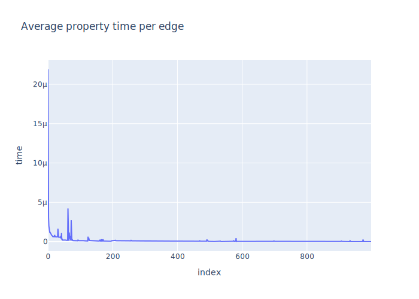

# Results
|    | node                                 |   value |
|---:|:-------------------------------------|--------:|
|  0 | pl. Daniłowskiego                   | 1.26923 |
|  1 | Wiejska                              | 1.15385 |
|  2 | Kadłubka                            | 1.15385 |
|  3 | Stanki                               | 1.15385 |
|  4 | Bukowskiego                          | 1.15385 |
|  5 | RACŁAWICKA                                      | 1.15385 |
|  6 | Rymarska                             | 1.15385 |
|  7 | Wawrzyniaka                          | 1.15385 |
|  8 | Chłodna                             | 1.15385 |
|  9 | Sowia                                | 1.15385 |
| 10 | Solskiego                            | 1.13462 |
| 11 | Berenta                              | 1.11538 |
| 12 | KROMERA                              | 1.11538 |
| 13 | Wyszyńskiego                        | 1.11538 |
| 14 | OgrĂłd Botaniczny                    | 1.11538 |
| 15 | Katedra                              | 1.11538 |
| 16 | UrzÄ…d WojewĂłdzki (Muzeum Narodowe) | 1.11538 |
| 17 | skwer Krasińskiego                  | 1.11538 |
| 18 | Arkady (Capitol)                     | 1.11538 |
| 19 | Pl. Hirszfelda                       | 1.11538 |

